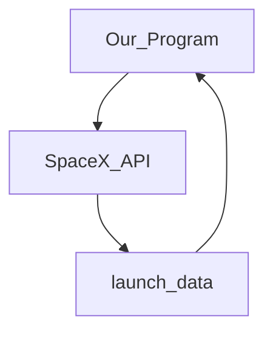
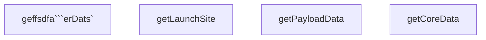

## Data Collection
- The following url is used as a source of the spacex launch data.
```url = "https://api.spacexdata.com/v4/launches/past"```
- ```requests``` library is used to get the http response from the above url and the corresponding json is then converted to a pandas dataframe using  ```data = pd.json_normalize(response.json())``` 
- The obtained dataframe contains information regarding the rocket, payloads, launchpad, cores, flight_number, date_utc, etc. in the form of an API endpoint key which is used to obtain the required data for each of the data points. The functions ```getBoosterVersion(...), getLaunchSite(...), getPayloadData(...), getCoreData(...)``` achieve this for us.


